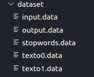
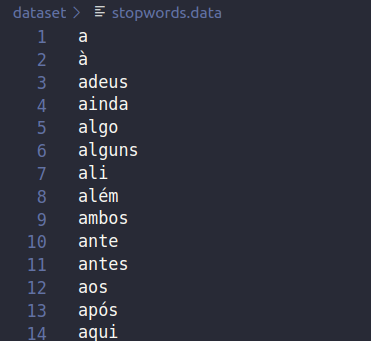
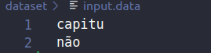
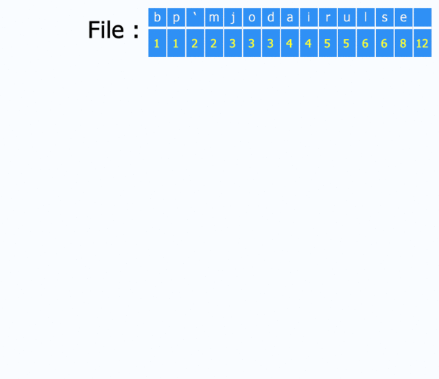
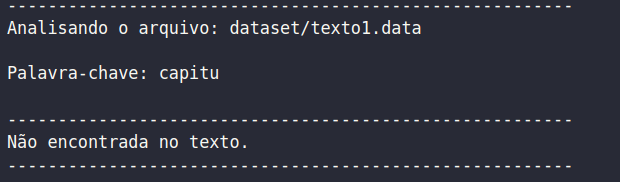
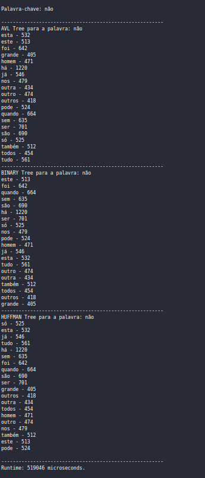

# Sistema de Autocompletar e Sugestões de Palavras
## Problema Proposto

Imagine que você está lidando com um conjunto de textos diversificados, e deseja encontrar as palavras mais significativas em cada um deles. No entanto, a relevância das palavras não é determinada apenas por sua frequência geral. Ela é especificamente relacionada a uma palavra-chave fornecida. A tarefa é encontrar as "top k" palavras mais frequentes em cada texto que estão diretamente relacionadas à palavra-chave.

## Interpretação do Problema

1. Leitura dos Dados: Os dados dos arquivos de texto são lidos para análise.

2. Contagem de Palavras: Divisão do  texto em palavras, para ser possível contar quantas vezes cada palavra aparece, o que será útil para a análise estatística.

3. Heap para Top K Elementos: Um heap (estrutura de dados de fila de prioridade) que é usado para manter os "top k" elementos de cada texto. O tamanho de "k" será 20 no algoritmo.

4. Pesquisa por Palavra-chave: Antes de inserir palavras no heap, é feita uma pesquisa pela palavra-chave fornecida. Se a palavra-chave não for encontrada no texto, a análise para esse texto é interrompida. Se a palavra-chave for encontrada, a frequência dessa palavra é registrada e a palavra depois da sua análise tem seu valor de frequência mudado para 1, para garantir que ela não seja exibida no heap.

5. Criação das Árvores: Para cada texto onde a palavra-chave foi encontrada, três estruturas de dados são criadas:

      • Árvore AVL: Uma árvore de busca binária balanceada onde as palavras são inseridas de acordo com sua frequência.

      • Árvore de Huffman: Uma árvore de Huffman é construída usando as frequências das palavras.

      • Árvore Binária: Uma árvore binária onde as palavras são inseridas de acordo com sua frequência.

6. Impressão das Árvores: As três estruturas de dados (Árvore AVL, Árvore de Huffman e Árvore Binária) são impressas para cada texto para cada palavra-chave que foi encontrada.

## Entrada
As entradas do programa são essenciais para o correto funcionamento do processo de identificação e análise das palavras mais frequentes nos textos fornecidos. Para organizar as entradas de maneira consistente, o programa segue um padrão de nomenclatura de arquivos e estes estão localizados dentro da pasta chamada dataset.




Primeiramente, os textos que serão processados são armazenados em arquivos com nomes que seguem o formato "textoN.data", onde "N" é um número inteiro que começa em 0 e é incrementado para cada novo arquivo. Esses arquivos contêm os textos completos que serão analisados em busca das palavras mais frequentes.

Além disso, o programa utiliza um arquivo denominado "stopwords.data". Esse arquivo é crucial para o processo de análise, pois contém uma lista de palavras conhecidas como "stop words" ou palavras vazias. Essas palavras são comuns na língua, como artigos, preposições e pronomes, mas geralmente não são relevantes para a análise de frequência de palavras. Portanto, o programa as ignora  ao identificar as mais frequentes nos textos, garantindo que o foco esteja nas palavras lexicais significativas.



Outro arquivo importante é o "input.data". Esse arquivo fornece ao programa um conjunto de palavras-chave específicas nas quais o programa baseará sua análise para identificar as palavras mais frequentes. Essas palavras-chave são essenciais para a análise direcionada, pois permitem que o programa encontre as palavras mais relevantes em relação às palavras-chave fornecidas.



## Implementação
Na implementação é usada a linguagem C++ por haver muitas vantagens na manipulação de arquivos. O primeiro passo da implementação é a abertura dos arquivos para que possa ler as palavras que serão ignoradas e as que irão para a tabela de dipersão para posteriormente fazerem parte da árvore de prioridades.

### Hash

A estrutura utilizada como tabela de dispersão foi o *unordered_map* . Essa ferramenta oferece uma maneira eficaz de associar valores a chaves únicas. Cada chave mapeia para um valor correspondente, permitindo a criação de estruturas de dados flexíveis e ágeis. Isso ocorre por seu uso se basear em tabelas hash . Quando você insere um par chave-valor, a estrutura calcula um valor de hash exclusivo para a chave. Esse valor de hash determina diretamente a posição onde o valor é armazenado internamente, permitindo uma busca direta quase instantânea. Como resultado, o tempo médio para acessar um valor é constante (O(1)).

Uma das situações importantes a serem consideradas ao usar um *unordered_map* é o tratamento de colisões. Colisões ocorrem quando duas chaves diferentes resultam no mesmo valor de hash. Essa estrutura de dados é projetada para lidar automaticamente com essas colisões, utilizando métodos como encadeamento (armazenar múltiplos valores em uma mesma posição usando uma lista ligada) ou endereçamento aberto (tentar encontrar a próxima posição disponível em caso de colisão).

O C++ não detalha como as funções de hash devem ser criadas para diferentes tipos. Essa responsabilidade fica a critério de cada empresa que desenvolve compiladores. Por exemplo, no caso do compilador GCC, a função de hash para o tipo std::string é formulada igual abaixo:

```
template<>
struct hash<string>
    : public __hash_base<size_t, string>
{
    size_t
    operator()(const string& __s) const noexcept
{ return std::_Hash_impl::hash(__s.data(), __s.length()); }
};
```

Dentro do corpo dessa função, há a utilização de um ajudante chamado std::_Hash_impl::hash, o qual possui a implementação a seguir:

```
size_t _Hash_bytes(const void* ptr, size_t len, size_t seed)
{
  const size_t m = 0x5bd1e995;
  size_t hash = seed ^ len;
  const char* buf = static_cast<const char*>(ptr);

  // Mix 4 bytes at a time into the hash.
  while (len >= 4)
  {
    size_t k = unaligned_load(buf);
    k *= m;
    k ^= k >> 24;
    k *= m;
    hash *= m;
    hash ^= k;
    buf += 4;
    len -= 4;
  }

  switch (len)
  {
    case 3:
      hash ^= static_cast<unsigned char>(buf[2]) << 16;
      [[gnu::fallthrough]];
    case 2:
      hash ^= static_cast<unsigned char>(buf[1]) << 8;
      [[gnu::fallthrough]];
    case 1:
      hash ^= static_cast<unsigned char>(buf[0]);
      hash *= m;
  };

  hash ^= hash >> 13;
  hash *= m;
  hash ^= hash >> 15;
  return hash;
}

```
Abaixo temos um exemplo de inserção em uma hash.


### Heap (Min Heap):
O heap é uma estrutura fundamental para este problema. As principais funções relacionadas ao heap são:

insert: Esta função insere uma palavra no heap. Quando uma nova palavra é lida dos textos de entrada, ela é inserida no heap, mantendo a ordem de prioridade. Se o tamanho do heap exceder k, a palavra com a menor frequência é removida.

buildHeap: A função buildHeap é usada para construir o heap a partir do zero. Inicialmente, o heap está vazio, e à medida que as palavras são lidas, elas são inseridas no heap. Esta função garante que o heap contenha apenas as k palavras mais frequentes.


### Árvore Binária:
A Árvore Binária armazena as palavras e suas frequências. As funções associadas à Árvore Binária são:

insert: Cada palavra presente no heap é inserida na Árvore Binária. A inserção é feita de forma que as palavras menores são colocadas à esquerda e as maiores à direita. A Árvore Binária é construída com base nas palavras do heap.

search: A função search é usada para procurar uma palavra específica na Árvore Binária. Isso é útil para verificar se uma palavra pesquisada posteriormente já foi inserida na Árvore Binária.


### Árvore de Huffman:
A Árvore de Huffman é usada para criar uma codificação eficiente para as palavras com base em suas frequências. As principais funções relacionadas à Árvore de Huffman são:

buildHuffmanTree: Esta função é responsável por construir a Árvore de Huffman. Ela começa com os nós folha representando as palavras e suas frequências, que são inicialmente inseridos no heap. Em seguida, combina repetidamente os dois nós do heap com as frequências mais baixas até que apenas um nó permaneça, que se torna a raiz da Árvore de Huffman.

generateCodes: Após a construção da Árvore de Huffman, a função generateCodes é usada para gerar códigos de Huffman para cada palavra. Esses códigos são usados posteriormente para codificar as palavras nos textos.



### Árvore AVL:
A Árvore AVL é uma árvore de busca balanceada que armazena as palavras e suas frequências. As principais funções relacionadas à Árvore AVL são:

insert: Assim como na Árvore Binária, cada palavra presente no heap é inserida na Árvore AVL. No entanto, a Árvore AVL é automaticamente reequilibrada após cada inserção para garantir que sua altura permaneça limitada. Isso é importante para manter a eficiência das operações de busca na árvore.

search: Similar à Árvore Binária, a função search é usada para procurar uma palavra específica na Árvore AVL. A pesquisa é realizada em uma árvore balanceada, o que garante uma busca eficiente.


## Saída
A saída do programa resultará na apresentação das três estruturas de dados: Árvore AVL, Árvore Binária e Árvore de Huffman  construídas a partir das palavras mais frequentes presentes nos textos de entrada, conforme especificado pelo valor de "k" que é 20.

Na próxima imagem veremos a saída do output.data, primeiro há qual arquivo de texto está sendo analiso e depois a palavra.



Nesse imagem acima, a palavra buscada foi "capitu" no texto1.data e essa palavra não foi encontrada no texto. Logo, não houve impressão das árvores.

Nessa próxima imagem veremos a busca da palavra-chave "não" e as árvores impressas, visto que ela existe no texto.



E no final do arquivo de saída também mostra o tempo de execução. Quanto maior o número de palavras no input, maior será o tempo de execução.

## Conclusão

A solução proposta oferece uma abordagem robusta e eficiente para a identificação das palavras mais relevantes em textos relacionados a uma palavra-chave específica. A combinação de estruturas de dados como Árvores AVL, Árvores de Huffman e Árvores Binárias permite uma análise aprofundada da frequência e relevância das palavras em diferentes contextos. Essa abordagem é ideal para lidar com grandes volumes de informações de forma direcionada e precisa, tornando-a uma ferramenta valiosa na análise de texto e na extração de informações relevantes.


## Compilação e Execução

O Sistema de Autocompletar e Sugestões de Palavras disponibilizado possui um arquivo Makefile que realiza todo o procedimento de compilação e execução. Para tanto, temos as seguintes diretrizes de execução:


| Comando                |Função                                                                                           |                     
| -----------------------| ------------------------------------------------------------------------------------------------- |
|  `make clean`          | Apaga a última compilação realizada contida na pasta build                                        |
|  `make`                | Executa a compilação do programa utilizando o gcc, e o resultado vai para a pasta build           |
|  `make run`            | Executa o programa da pasta build após a realização da compilação                                 |

É recomendado executar um `make clean` antes do `make` .

## Referências

- STAPLES, A. B. e G. What is the default hash function used in C++ std::unordered_map? Disponível em: https://stackoverflow.com/questions/19411742/what-is-the-default-hash-function-used-in-c-stdunordered-map.

- KUMAR hitesh. A bit about Heap. Disponível em: https://smellycode.com/binary-heap/.

- KHIM, K. T. e J. Hash Tables. Disponível em: https://brilliant.org/wiki/hash-tables/.

- HUFFMAN huff demo.gif. Disponível em: https://en.wikipedia.org/wiki/File:Huffman_huff_demo.gif.

- AVL TREE Example.gif. Disponível em: https://en.m.wikipedia.org/wiki/File:AVL_Tree_Example.gif.

- BINARY Trees (Part 2) - Binary-Search Trees are the BeST. Disponível em: https: //dev.to/jenshaw/binary-search-trees-are-the-best-gkk.

