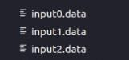
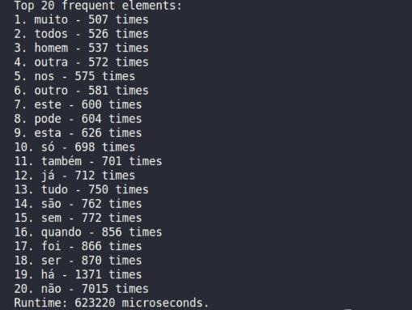

# TOP K ELEMENTOS
## Exercício Proposto

Um exemplo clássico de problema que pode ser solucionado utilizando-se hash e heap é o
chamado top k itens. Neste problema, é preciso encontrar os k itens mais valiosos de uma
coleção de dados. Logo, utiliza-se o hash para contar a frequência de todos os itens, enquanto
o heap se aplica na manutenção de uma lista dos k itens de maior valor. Sabendo-se disso,
elabore uma solução em C/C++ que dado uma entrada:


• Crie uma tabela de dispersão (hash) para contar a frequência de cada elemento tokenizado da coleção de dados de entrada.

• Crie uma árvore de prioridades (heap) de tamanho k e insira os primeiros k elementos do
hash nela.

1. Para cada elemento restante na hash, compare a contagem com o menor valor do
heap.
2. Se a contagem for maior do que o menor valor da heap, remova o menor valor, insira
o novo elemento e refaça a estrutura.
3. Caso contrário, ignore o elemento e vá para o próximo.

• No final, a heap conterá os k elementos com maiores valores (frequências) da coleção
de dados. Então, imprima-os em ordem crescente.

## Interpretação do Exercício

O desafio é encontrar os k elementos mais importantes ou frequentes em um grupo de dados que será fornecido por um arquivo "input.data". Imagine que você tenha muitas informações e queira identificar aquelas que aparecem com mais frequência. Para isso é necessário um processo eficiente que permita identificar esses elementos de maneira rápida e econômica. 

Então, a abordagem proposta utiliza duas estruturas de dados cruciais: uma tabela de dispersão (hash) e uma árvore de prioridades (heap).

A tabela de dispersão é uma estrutura que associa chaves a valores. No contexto desse problema, cada elemento da coleção de dados é mapeado para a tabela hash, onde a chave é o elemento em si e o valor é a contagem de quantas vezes esse elemento aparece na coleção. Isso permite a rápida consulta e atualização das frequências dos elementos.

A árvore de prioridades, conhecida como heap, é uma estrutura que mantém os elementos organizados conforme uma ordem de prioridade específica. Nesse caso, a prioridade é determinada pela frequência dos elementos.

No final, o programa conseguirá apresentar o que foi requisitado no problema.

## Entrada

A entrada consiste em um ou mais arquivos de textos que serão lidos para a contagem de palavras. Nos arquivos usados para teste contém as obras do Machado de Assis : "Dom Casmurro" e "A Semana".

O nome deles deverão seguir o seguinte padrão "input0.data", o próximo deverá ser o "input1.data" e para os seguintes deverá somar mais 1 ao número após o input. Veja o exemplo:



Também há um arquivo que deverá ser fornecido chamado de "stopwords.data". Nesse arquivo será fornecido as palavras que deverão ser dispensadas por serem comuns, como os artigos,  para que as palavras lexicais sejam exibidas na lista das mais frequentes.


## Implementação

Na implementação é usada a linguagem C++ por haver muitas vantagens na manipulação de arquivos. O primeiro passo da implementação é a abertura dos arquivos para que possa ler as palavras que serão ignoradas e as que irão para a tabela de dipersão para posteriormente fazerem parte da árvore de prioridades.

### Hash

A estrutura utilizada como tabela de dispersão foi o *unordered_map* . Essa ferramenta oferece uma maneira eficaz de associar valores a chaves únicas. Cada chave mapeia para um valor correspondente, permitindo a criação de estruturas de dados flexíveis e ágeis. Isso ocorre por seu uso se basear em tabelas hash . Quando você insere um par chave-valor, a estrutura calcula um valor de hash exclusivo para a chave. Esse valor de hash determina diretamente a posição onde o valor é armazenado internamente, permitindo uma busca direta quase instantânea. Como resultado, o tempo médio para acessar um valor é constante (O(1)).

Uma das situações importantes a serem consideradas ao usar um *unordered_map* é o tratamento de colisões. Colisões ocorrem quando duas chaves diferentes resultam no mesmo valor de hash. Essa estrutura de dados é projetada para lidar automaticamente com essas colisões, utilizando métodos como encadeamento (armazenar múltiplos valores em uma mesma posição usando uma lista ligada) ou endereçamento aberto (tentar encontrar a próxima posição disponível em caso de colisão).

O C++ não detalha como as funções de hash devem ser criadas para diferentes tipos. Essa responsabilidade fica a critério de cada empresa que desenvolve compiladores. Por exemplo, no caso do compilador GCC, a função de hash para o tipo std::string é formulada igual abaixo:

```
template<>
struct hash<string>
    : public __hash_base<size_t, string>
{
    size_t
    operator()(const string& __s) const noexcept
{ return std::_Hash_impl::hash(__s.data(), __s.length()); }
};
```

Dentro do corpo dessa função, há a utilização de um ajudante chamado std::_Hash_impl::hash, o qual possui a implementação a seguir:

```
size_t _Hash_bytes(const void* ptr, size_t len, size_t seed)
{
  const size_t m = 0x5bd1e995;
  size_t hash = seed ^ len;
  const char* buf = static_cast<const char*>(ptr);

  // Mix 4 bytes at a time into the hash.
  while (len >= 4)
  {
    size_t k = unaligned_load(buf);
    k *= m;
    k ^= k >> 24;
    k *= m;
    hash *= m;
    hash ^= k;
    buf += 4;
    len -= 4;
  }

  switch (len)
  {
    case 3:
      hash ^= static_cast<unsigned char>(buf[2]) << 16;
      [[gnu::fallthrough]];
    case 2:
      hash ^= static_cast<unsigned char>(buf[1]) << 8;
      [[gnu::fallthrough]];
    case 1:
      hash ^= static_cast<unsigned char>(buf[0]);
      hash *= m;
  };

  hash ^= hash >> 13;
  hash *= m;
  hash ^= hash >> 15;
  return hash;
}

```
Abaixo temos um exemplo de inserção em uma hash.


### Heapify e Heap

No programa foi utilizado um min-heap, ou heap mínimo, que é uma estrutura de dados que se assemelha a uma árvore binária especial, utilizada principalmente para organizar elementos com base em seus valores. No contexto de um min-heap, cada nó da árvore possui um valor menor ou igual aos valores de seus nós filhos. Essa propriedade fundamental do min-heap torna possível que o elemento com o valor mínimo esteja sempre localizado no topo da árvore, ou seja, no nó raiz.

E há algumas funções para que ele ocorra corretamente e cumpra o desejado para a solução do problema. Elas são:

1. Função heapify:
    A função heapify é responsável por ajustar um nó específico na árvore heap de forma a manter a propriedade do heap, que é que o valor de cada nó seja menor ou igual ao valor dos seus filhos. A função recebe três parâmetros: o vetor heap, o tamanho atual do heap size e o índice do nó que precisa ser ajustado index.
        
    •  Primeiro, são calculados os índices dos filhos esquerdo e direito do nó em questão.
    
    •  Em seguida, são verificadas as condições para garantir que o nó atual tenha o valor menor entre o próprio nó e seus filhos. Se isso não acontecer, ocorre uma troca de valores entre o nó atual e o menor filho.
    
    •Se ocorrer uma troca, a função é chamada recursivamente no índice do menor filho, de forma a verificar se a troca afetou os descendentes.

2. Função buildHeap:
    A função buildHeap é usada para construir um heap válido a partir do vetor fornecido. Ela percorre o vetor de trás para frente, começando pela primeira posição que possui filhos (geralmente o último nível não-folha da árvore), e aplica a função heapify para cada nó, garantindo que a propriedade de heap seja mantida.

3. Função findTopKFrequent:
    Esta é a função principal que encontra as palavras mais frequentes. Ela começa criando um mapa de frequência freqMap que mapeia palavras para suas contagens.
        
    • Em seguida, o código itera por todas as entradas do freqMap, adicionando cada entrada ao heap. Se o tamanho do heap ainda não atingiu k, a entrada é simplesmente adicionada.
        
    • Caso contrário, se a contagem da entrada atual for maior do que a contagem da entrada no topo do heap (que é a entrada com a menor contagem entre as k maiores), a entrada do topo é substituída pela nova entrada e então a função heapify é chamada para ajustar a posição do novo topo, mantendo a propriedade do heap.

    • Após inserir todas as entradas no heap, a função buildHeap é chamada para garantir que o heap esteja corretamente organizado.
    
    • Por fim, o vetor heap é retornado como o resultado contendo as k palavras mais frequentes.

Aqui está um exemplo visual de como a inserção no Heap funciona.


## Informações Adicionais

O top k elementos tem definido k como 20. Logo, o programa informa as 20 palavras mais utilizadas das entradas disponibilizadas descartando as stopwords.Além de fazer o tratamento de algumas palavras.

### Tratamento

Os textos usados apresentam certas incongruências ao serem lidos. Por exemplo, se uma palavra é seguida imediatamente por pontuação ('?' '!' ',' '.' ';' ':') sem espaço algum, o computador a interpretava como uma nova palavra. Por conseguinte, foi preciso inserir um espaço após essa palavra, garantindo que a pontuação não interferisse na leitura e contagem das palavras. Também existe um hífen que é chamado de "em dash " (—) e é representado por 3 bytes. Onde foi identificado esse caractere foi alterado por espaço. No caso do hífen simples (-), se era antes da palavra e antes dele era vazio ou uma pontuação, ele foi substituído por espaço. Mas,  se fosse depois, o código verifica se o proxímo é uma letra ou espaço, na letra não o substitui , no vazio ocorre a substituição.

## Saída

Testando com as entradas [input0.data](dataset/input0.data) e [input1.data](dataset/input1.data), utilizando o arquivo de stopwords: [stopwords.data](dataset/stopwords.data), o resultado obtido foi:



## Conclusão

Portanto, a combinação estratégica do *unordered_map* para rastrear frequências e do *min-heap* para manter as palavras mais frequentes forma uma abordagem robusta. A rapidez do acesso ao unordered_map é essencial para coletar dados precisos sobre a frequência das palavras. Enquanto isso, o min-heap garante que o foco permaneça nas palavras mais relevantes, ajustando-se automaticamente à medida que novos dados chegam. Esta sinergia eficiente torna possível encontrar as 20 palavras mais frequentes de maneira otimizada, ideal para lidar com grandes volumes de informações de forma direcionada e precisa.

## Compilação e Execução

O Top K Elements disponibilizado possui um arquivo Makefile que realiza todo o procedimento de compilação e execução. Para tanto, temos as seguintes diretrizes de execução:


| Comando                |Função                                                                                           |                     
| -----------------------| ------------------------------------------------------------------------------------------------- |
|  `make clean`          | Apaga a última compilação realizada contida na pasta build                                        |
|  `make`                | Executa a compilação do programa utilizando o gcc, e o resultado vai para a pasta build           |
|  `make run`            | Executa o programa da pasta build após a realização da compilação                                 |

É recomendado executar um `make clean` antes do `make` .

## Referências

- STAPLES, A. B. e G. What is the default hash function used in C++ std::unordered_map? Disponível em: https://stackoverflow.com/questions/19411742/what-is-the-default-hash-function-used-in-c-stdunordered-map.

- KUMAR hitesh. A bit about Heap. Disponível em: https://smellycode.com/binary-heap/.

- KHIM, K. T. e J. Hash Tables. Disponível em: https://brilliant.org/wiki/hash-tables/.
